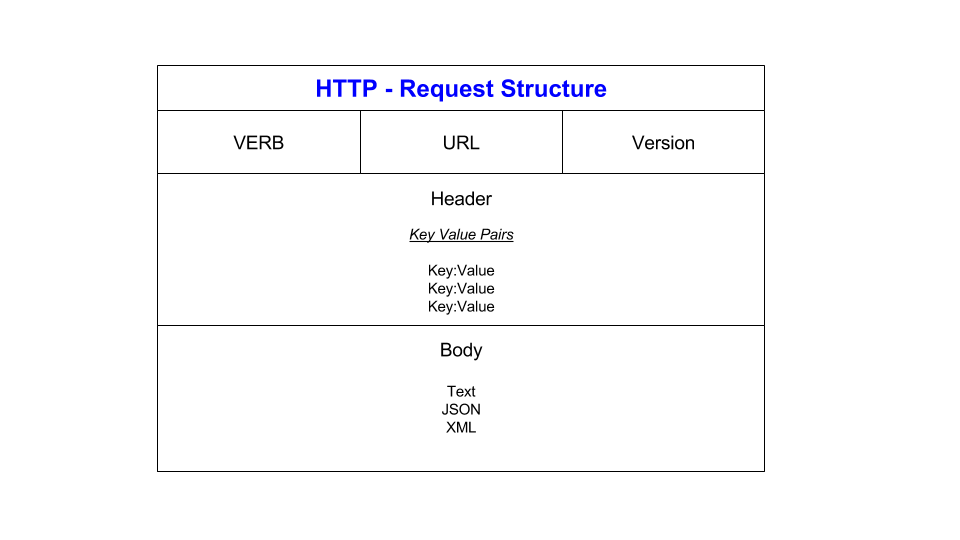

# What are apis?

#### communication method in real-time between two services/applications/pieces of software/software systems e.g. amazon and paypal
#### kind of like a waiter or a translator - the go between for two people
#### helps to reduce operational costs for organisations
#### Facilitates communication between system
# diagram to showcase apis

***

***


# What is a REST API? What makes an API restful

## Representation State Transfer

#### A RESTful API is an architectural style for an application program interface (API) that uses HTTP requests to access and use data. That data can be used to GET, PUT, POST and DELETE data types, which refers to the reading, updating, creating and deleting of operations concerning resources.
#### REST guidelines
#### CRUD - create, read, update and delete
#### Uniform interface 
#### Stateless
#### Decoupling
#### Caching
#### Layered architecture
#### High performance/speed
#### standard/common data formats (json/xml)
#### Representation data flow - The resource in question needs to be completely delivered. Confirmation of delivery and receipt


# What is http?
#### Hypertext Transfer **Protocol** (HTTP) is a method for encoding and transporting information between a client (such as a web browser) and a web server. HTTP is the primary protocol for transmission of information across the Internet.
# Explain http and https
#### HTTPS is HTTP with encryption and verification. S is for Secure.
#### The only difference between the two protocols is that HTTPS uses TLS (SSL) to encrypt normal HTTP
#### It also digitally sign those requests and responses. As a result, HTTPS is far more secure than HTTP.


# Diagram for http request 


- Verb: GET or other Verb
- URL: http://example.com
- Headers: e.g. Version:1.1 , Content-Type: application/json , Date, Last Modified, Cache-used, Cache expiry, age
- Body: Data to be sent

# Diagram for http response


- Response Code : 200
- HTTP Version : e.g. 404, 401, 500
- Headers: information should be the same as request
- Body:
# What are do the HTTP verbs do?


- Get : Retrieve data
- Post : sends data or updates resource
- Put : Updates and makes a new resource
- Patch : Modifies existing resource
- Delete : Deletes resource


# What is statelessness?

#### The server doesn't store any data about the clients previous request
#### The api does not depend on the preivous requests success/failure for it to work

e.g. 
```python
api/customer/1 
api/nextcustomer
```


# What is caching?
- Store of data that is used often/recently so you don't need to do as much work.(speeds things up)